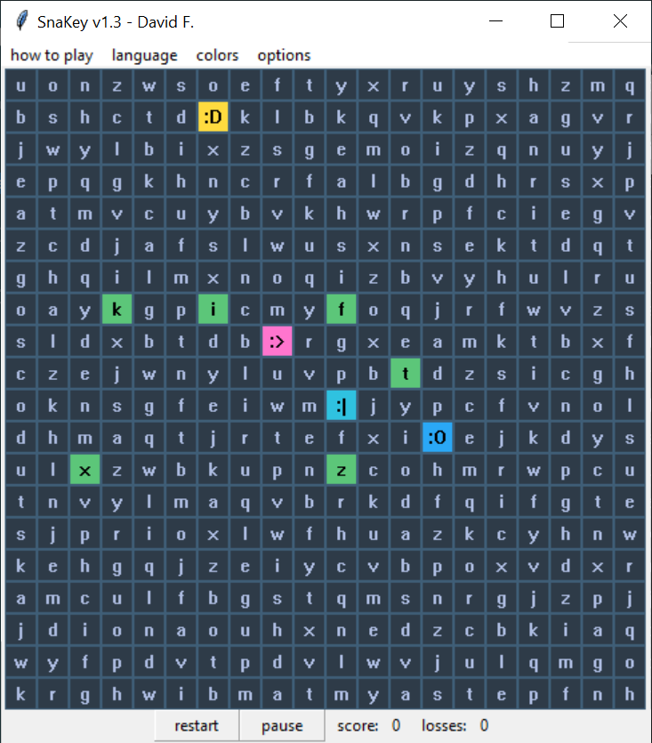

# :snake::computer: SnaKey

[click here to play](index.html)

## :train: Introduction

| `sample_in_game_screenshots` | version |
|:------------------------:|---------|
|  | It was the February of 2018 when I wrote the bulk of [the first version of this game](https://github.com/david-fong/SnaKey) in Python. At the time, I had pretty much just finished learning Python over the Winter break, and I wanted to do something original with it. I came up with the start of an idea spinning off of the classic [Snake Game](https://wikipedia.org/wiki/Snake_(video_game_genre)), with a twist on the movement mechanic: to move by typing. In this version, there were color themes, basic language support (Japanese Hiragana and Katakana), and basic computer-opponents. |
|  | I finished that version, and excitedly showed my friends. Some were pretty enthusiastic about it, and so, I decided that I wanted to try and make it more accessible. I started reading about how basic webpages are built up using HTML, JavaScript, and CSS, and I slowly worked on porting the game to be hosted on the web via GitHub-Pages as [the second version of this game](https://github.com/david-fong/SnaKey-JS).  In this version, which I wrote the bulk of in March of 2018, I wrote everything using NotePad++, and used pure HTML, Javascript, and CSS. Looking back, I think this really set me up with a good foundational understanding of how things worked, as opposed to what might have been the case if I started looking at various frameworks and transpiling languages right away. It has also made me appreciate the value of strong typing, and choosing conventions for things such as naming. Javascript is really so slack when it comes to such basic things that it's easy to write things that don't read well or make much sense. |
| no image yet! | This brings us to where we are now- around November of 2019. The goal of this version is to push the game out to the world of internet-enabled multiplayer. Although I've recently gotten comfortable working in the terminal environment, for this project, I decided to try using VSCode, since it looked like it would offer good intellisense for TypeScript, which I was looking to learn to use. I spent significant time learning how to set up linting for TypeScript with VSCode, and learning about ES6's native module system. I was really impressed with how good the integration is between VSCode and various plugins and typing constructs. |

One of the big challenges for this project is to give the user the choice between playing completely offline (after fetching all the game's HTTP objects), and playing online. I like this challenge because it really demands designing a good function API, and working with inheritence to share as much code as possible. One interesting resulting demand is in what each side of the picture needs to do:

|                                            | Offline | Server | Client |
:-------------------------------------------:|:-------:|:------:|:------:|
| Maintain the master copy of the game state | :heavy_check_mark: | :heavy_check_mark: | :heavy_multiplication_x: |
| Display the game state via the browser DOM | :heavy_check_mark: | :heavy_multiplication_x: | :heavy_check_mark: |
| Use network operations to exchange events  | :heavy_multiplication_x: | :heavy_check_mark: | :heavy_check_mark: |
